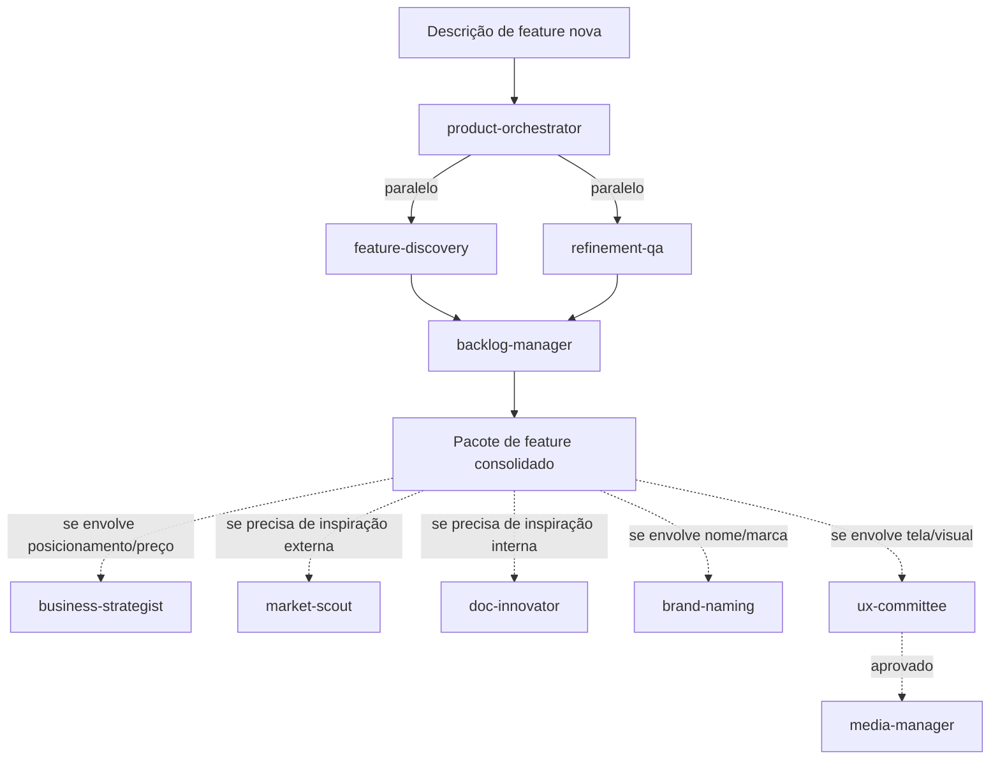
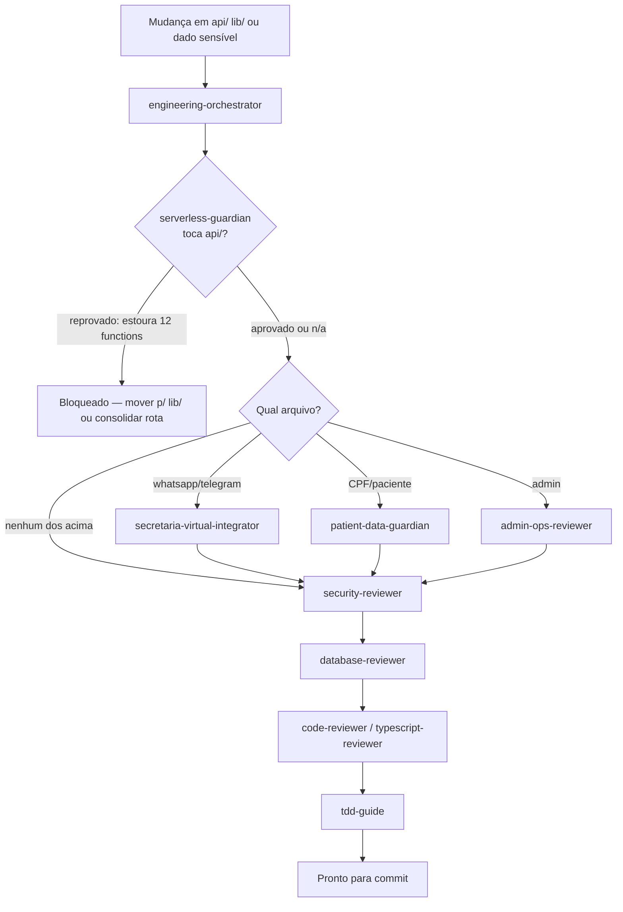

# Pipeline de Agentes — Nutrivvo

Índice central dos agentes do projeto, organizado em duas trilhas encadeadas. Os arquivos de agente continuam **flat** em `.claude/agents/` (é o único jeito do Claude Code descobri-los) e em `~/.claude/agents/` (globais, compartilhados entre projetos) — esta pasta é só o mapa de como eles se encadeiam.

```
.claude/
├── agents/                          ← agentes do projeto (flat, obrigatório)
│   ├── brand-naming.md              } trilha PRODUTO (já existiam)
│   ├── business-strategist.md       }
│   ├── doc-innovator.md             }
│   ├── market-scout.md              }
│   ├── media-manager.md             }
│   ├── ux-committee.md              }
│   ├── serverless-guardian.md       } trilha ENGENHARIA (novos, criados agora)
│   ├── secretaria-virtual-integrator.md }
│   ├── patient-data-guardian.md     }
│   ├── admin-ops-reviewer.md        }
│   └── engineering-orchestrator.md  }
└── agent-pipeline/
    └── README.md                    ← você está aqui
```

Agentes globais referenciados (vivem em `~/.claude/agents/`, não duplicados aqui de propósito — são reusados em todos os projetos): `product-orchestrator`, `feature-discovery`, `refinement-qa`, `backlog-manager`, `security-reviewer`, `database-reviewer`, `typescript-reviewer`, `react-reviewer`, `code-reviewer`, `tdd-guide`, `planner`, `architect`.

---

## Trilha 1 — Produto

### Ativadores

| Agente | Ativador (quando dispara) |
|---|---|
| `product-orchestrator` *(global)* | Toda vez que chega descrição de **feature nova** — é o ponto de entrada da trilha. |
| `feature-discovery` *(global)* | Disparado pelo orchestrator, em paralelo com `refinement-qa`. Também isolado antes de qualquer refinamento/desenvolvimento. |
| `refinement-qa` *(global)* | Disparado pelo orchestrator, em paralelo com `feature-discovery`. |
| `backlog-manager` *(global)* | Após Fase 1 (discovery + refinement), para registrar/validar no `backlog.md`. |
| `business-strategist` | Antes de decisão de rebranding, precificação, ou quando `prd.md`/`v2_product_strategy.md`/`features.md` estiverem contraditórios entre si. |
| `market-scout` | Pedido de benchmark competitivo, gap analysis, "o que mais podemos fazer" vindo de fora. |
| `doc-innovator` | Pedido de ideia nova cruzando o que **já está documentado**, sem pesquisa externa. |
| `brand-naming` | Pedido de nome de marca / rebranding / checagem de domínio e handle. |
| `ux-committee` | Antes de finalizar mudança visual relevante (logo, redesign de tela, novo componente). |
| `media-manager` | Planejamento de calendário/campanha para Instagram/TikTok. |

### Workflow encadeado



`business-strategist` é a fonte de verdade que `brand-naming` e `media-manager` devem seguir — sempre rodar antes deles se houver ambiguidade de posicionamento.

---

## Trilha 2 — Engenharia (nova)

### Ativadores

| Agente | Ativador (quando dispara) |
|---|---|
| `engineering-orchestrator` | Qualquer mudança em `api/`, `lib/`, `vercel.json`, ou fluxo de webhook/admin/paciente — **ponto de entrada da trilha**. |
| `serverless-guardian` | Antes de criar qualquer arquivo em `api/`, antes de deploy, ou se o build/deploy falhar por limite de functions. |
| `secretaria-virtual-integrator` | Mudança em `api/whatsapp-webhook.js`, `api/telegram-webhook.js`, `lib/whatsapp.js`, `lib/telegram.js`, `lib/secretariaVirtual.js`. |
| `patient-data-guardian` | Mudança em `api/patient-cpf-guard.js`, `lib/patients.js`, ou qualquer fluxo de cadastro/matching de paciente. |
| `admin-ops-reviewer` | Mudança em `api/admin.js` ou `src/features/admin/**`. |
| `security-reviewer` *(global)* | Sempre, na Fase 2 — obrigatório para auth/input externo/dado de usuário. |
| `database-reviewer` *(global)* | Se a mudança toca query/schema Postgres. |
| `tdd-guide` *(global)* | Feature nova ou bugfix — exige teste (padrão: `test-cpf-guard.mjs`). |

### Workflow encadeado



**Regra bloqueante**: Fase 0 (`serverless-guardian`) e Fase 2 (`security-reviewer`) nunca podem ser puladas — mesmo para mudanças "pequenas", conforme `.claude/rules/ecc/common/security.md` e o histórico real de incidente de deploy deste projeto (commit `4166704`).

---

## Como interseccionam

Uma feature que nasce na Trilha 1 (produto) e envolve dado de paciente ou canal de mensagem entra na Trilha 2 automaticamente na hora de implementar:

```
product-orchestrator → backlog-manager → (dev inicia implementação) → engineering-orchestrator → ... → commit
```

## Lições já capturadas (releia antes de tocar nesses pontos)

- **Limite de 12 functions do Vercel** — incidente real, commit `4166704`. `serverless-guardian` existe por causa disso.
- **Bug de auth do webhook WhatsApp** (`apikey` vs `apiKey`) — commit `784f913`. `secretaria-virtual-integrator` carrega essa checklist.
- **CPF único entre nutricionistas** — item de backlog ativo, commit `e32383a`. `patient-data-guardian` existe por causa disso.
