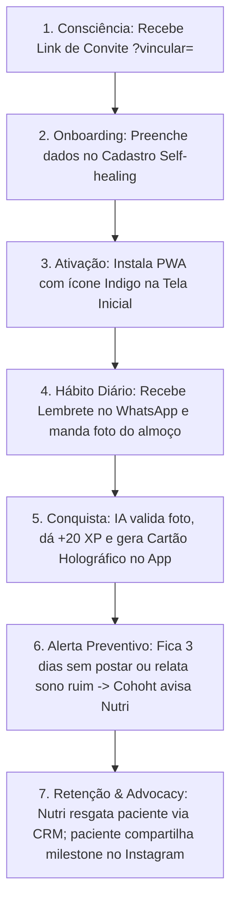
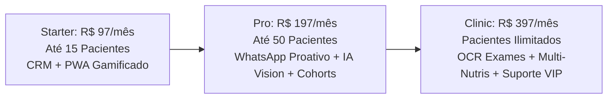

# Nutrivvo V2.0 — Master Product Strategy & Executable Roadmap
**Autor:** Antigravity (IA Co-Pilot & Product Lead)  
**Metodologia:** Execução do ecossistema de 27 skills (`.agents/skills`) aplicada ao contexto real da plataforma Nutrivvo.

---

## 1. Visão & Estratégia do Produto (`strategy`, `north-star`, `okr`)

### 1.1. Strategy Canvas (9 Blocos)
1. **Visão:** Ser o primeiro "Agente Ativo de Saúde" do mercado de nutrição, transformando softwares estáticos de consultório em assistentes comportamentais proativos 24/7.
2. **Segmento-Alvo:** Nutricionistas clínicos, consultorias de emagrecimento esportivo e clínicas integrativas que atendem pacientes particulares em modelos de recorrência (plano semestral/anual ou mensalidade).
3. **O Problema:** Softwares como Dietbox e Nutrium são arquivos digitais passivos. O paciente sai motivado da consulta, mas após 14 dias esquece de abrir o app, não bebe água, perde o foco e abandona o tratamento (churn > 50% no 3º mês).
4. **A Solução (Nutrivvo V2):** Um ecossistema híbrido onde o CRM gera inteligência preditiva (Cohorts de Risco) e uma IA Proativa vai até onde o paciente está (WhatsApp) para cobrar água, receber foto do prato e registrar XP sem fricção.
5. **Diferenciação:**
   - *Para o Paciente:* Gamificação High-End (Dark Mode, XP, Milestones compartilháveis e PWA sem burocracia de lojas de app).
   - *Para o Nutricionista:* Síntese Clínica de IA mastigada antes da consulta e alertas preventivos de evasão.
6. **Monetização:** SaaS B2B2C com modelo de assinatura mensal por camadas de recursos e quantidade de pacientes.
7. **Métricas-Chave:** Retenção de pacientes em 90 dias, Taxa de Check-ins Diários via Foto/WhatsApp, e Net Revenue Retention (NRR) dos Nutricionistas.
8. **Roadmap Macro:** 4 Sprints focadas em Infraestrutura Backend → WhatsApp Zero-Friction → Leitura OCR de Exames → Monetização via Stripe.
9. **Riscos Principais:** Custos de consumo da API OpenAI Vision e limites de rate/bloqueio de instâncias no WhatsApp.

### 1.2. North Star Metric (NSM) & Constelação de Input
- **North Star Metric:** `Total de Refeições Check-in (por Foto ou WhatsApp) validadas por semana.`  
  *(Justificativa: Mede exatamente o momento em que o valor é entregue para ambos os lados: o paciente se mantém na dieta e ganha XP, e o nutricionista recebe o dado de adesão em tempo real).*
- **Input Metrics:**
  - **Input 1 (Ativação):** % de pacientes cadastrados por link (`?vincular=...`) que instalam o PWA na tela inicial e fazem o 1º check-in em menos de 24h.
  - **Input 2 (Proatividade):** % de resposta positiva aos lembretes automáticos de refeição disparados via WhatsApp.
  - **Input 3 (Resgate Clínico):** Tempo médio de resposta do Nutricionista no CRM ao receber um status vermelho de "Perdendo Foco" no painel de Cohorts.

### 1.3. OKR Cascade Trimestral (V2 Launch)
- **Objetivo da Empresa (O1):** Tornar o Nutrivvo a plataforma com a maior taxa de adesão clínica do Brasil.
  - *KR1:* Elevar a taxa média de retenção dos pacientes na 4ª semana de 35% (média do mercado) para 70%.
  - *KR2:* Atingir 15.000 fotos de refeição processadas e validadas por IA no trimestre.
- **Objetivo de Produto & Engenharia (O2):** Zerar a fricção de engajamento do paciente na dieta.
  - *KR1:* Lançar o fluxo de check-in via WhatsApp com latência de resposta da IA Vision < 4 segundos.
  - *KR2:* Entregar Síntese Clínica da IA (com cruzamento de Cohorts) no CRM em < 3 segundos para 100% dos prontuários.
  - *KR3:* Manter 0% de regressões ou telas brancas em produção via estrito cumprimento do Quality Gate (`npm run build` + teste local).

---

## 2. Análise Competitiva & Posicionamento (`competitive-analysis`, `ideal-customer-profile`, `persona`)

### 2.1. Matriz de Concorrência
| Concorrente | Ponto Forte | Ponto Fraco (Gaps de Mercado) | Oportunidade / Posicionamento Nutrivvo |
| :--- | :--- | :--- | :--- |
| **Dietbox / WebDiet** | Tradição, banco enorme de alimentos e receitas normatizadas. | Apps genéricos, sem gamificação real, passivos (paciente tem que lembrar de entrar). | **Gamificação Viral + PWA Premium:** O Nutrivvo transforma a dieta num jogo diário com recompensas visuais e milestones compartilháveis. |
| **Nutrium** | Interface de consultório limpa e excelente marketing. | Focado em relatórios estáticos de PDF; zero inteligência preditiva ou alertas de evasão. | **Inteligência de Cohorts & Síntese:** O Nutrivvo avisa o Nutri *antes* do paciente desistir, cruzando queda de sono/água com risco de abandono. |
| **MyFitnessPal / Noom** | Excelente contagem autônoma de calorias (B2C direto). | Desconectado do profissional de saúde; não serve para gestão clínica de consultório (B2B). | **CRM Híbrido B2B2C:** A precisão do app B2C conectada em tempo real ao prontuário do Nutricionista que prescreveu a conduta. |

### 2.2. Ideal Customer Profile (ICP - Nutricionista)
- **Perfil:** Nutricionista Clínica ou Esportiva, idade entre 25 e 45 anos, com consultório particular (físico ou online) atendendo de 20 a 100 pacientes ativos por mês.
- **Modelo de Cobrança:** Cobra entre R$ 250 e R$ 600 por consulta ou vende pacotes de acompanhamento trimestral/semestral.
- **Dores Principais:** Perde 30% a 50% dos pacientes no 2º mês porque eles "desanimam" ou têm vergonha de voltar sem ter seguido a dieta. Perde horas extras montando PDFs de cardápio no fim de semana.
- **Proposta de Valor Nutrivvo:** O Nutrivvo assume o papel de "cobrador simpático" e co-piloto entre as consultas, garantindo que o paciente chegue ao 3º mês engajado e gerando renovação de contrato.

### 2.3. Persona de Produto (Paciente Gamificado)
- **Nome & Perfil:** "Enize", 34 anos, arquiteta, rotina intensa, treina 3x na semana e quer emagrecer 6kg com saúde.
- **Comportamento & JTBD (Jobs to Be Done):** 
  - *Quando* estou no meio de um dia de trabalho corrido e chega a hora do almoço...
  - *Eu quero* registrar rapidamente que comi salada e grelhado sem ter que abrir um app pesado e digitar grama por grama...
  - *Para que* eu sinta que estou progredindo no meu objetivo, mantenha minha ofensiva (streak) e receba o reconhecimento do meu nutricionista.

---

## 3. Descoberta & Jornada do Cliente (`discovery`, `customer-journey`, `opportunity-tree`)

### 3.1. Mapa da Jornada do Paciente Nutrivvo (7 Estágios)


### 3.2. Opportunity Solution Tree (OST)
- **Resultado Desejado (Outcome):** Aumentar em 50% a adesão de pacientes após o 30º dia de dieta.
  - **Oportunidade 1:** Pacientes têm preguiça de abrir o app para registrar refeições no meio da rotina.
    - *Solução:* **Check-in Zero-Friction no WhatsApp** (Envio de foto do prato respondendo ao bot).
    - *Experimento:* Testar fluxo de IA Vision validando pratos em 5 segundos via Vercel Serverless.
  - **Oportunidade 2:** Nutricionistas só descobrem que o paciente abandonou a dieta no dia da consulta de retorno (quando ele desmarca ou não vai).
    - *Solução:* **Inteligência de Cohorts atrelada à Síntese Clínica de IA**.
    - *Experimento:* Alerta visual laranja/vermelho (`⚠️ PERDENDO FOCO`) no dashboard principal do CRM disparando notificação para o profissional atuar proativamente.

---

## 4. Arquitetura Funcional & Especificação (`prd`, `user-stories`, `acceptance-criteria`, `hypothesis`)

### 4.1. PRD Enxuto — Módulo WhatsApp Proativo & IA Vision
- **Objetivo:** Permitir que o Nutrivvo interaja com o paciente no WhatsApp, enviando lembretes proativos e recebendo check-ins por foto validados por Inteligência Artificial (`gpt-4o-mini` Vision).
- **User Stories (Formato Mike Cohn / INVEST):**
  - `US-01: Como paciente ativo, quero receber um lembrete no WhatsApp no horário da minha refeição principal, para que eu não esqueça de me alimentar corretamente.`
  - `US-02: Como paciente, quero responder o lembrete com a foto do meu prato, para que a IA avalie minha refeição e credite meu XP sem eu precisar abrir o aplicativo.`
  - `US-03: Como nutricionista, quero que o sistema identifique padrões repetidos de compulsão ou má alimentação nas fotos do WhatsApp e registre um alerta no prontuário do paciente.`

### 4.2. Critérios de Aceite (Gherkin)
```gherkin
Feature: Check-in de Refeição Zero-Friction via WhatsApp
  Scenario: Paciente envia foto de prato saudável e ganha XP no Nutrivvo
    Given que o paciente "Thiago" possui uma conta ativa no Nutrivvo com telefone vinculado
    And está no horário previsto para o "Almoço" na dieta prescrita
    When o sistema disparar a mensagem proativa no WhatsApp e Thiago responder com uma imagem de um prato com frango, arroz e salada
    Then o webhook do backend deve capturar a imagem e enviá-la ao endpoint serverless "/api/openai-bridge" com modelo Vision
    And a IA deve retornar status "saudável", pontuação de adesão "90%" e resumo nutricional
    And o banco Firestore deve ser atualizado somando "+20 XP" e incrementando o "streak" do paciente
    And o bot do WhatsApp deve responder: "Excelente escolha, Thiago! 🥗 +20 XP creditados no seu Nutrivvo!"
```

### 4.3. Matriz de Hipóteses & Pretotyping (`hypothesis`, `experiment-design`)
- **Hipótese de Validação Rápida:** "Se dermos aos pacientes a opção de enviar a foto da refeição no WhatsApp em vez do aplicativo web, o número médio de registros diários subirá de 1.2 para 3.5 registros/dia."
- **Desenho do Experimento (Pretotyping / Mágico de Oz):** Antes de contratar provedores pagos de WhatsApp API para toda a base, rodar 2 semanas com um grupo controle de 10 pacientes de um Nutricionista parceiro, usando uma instância simples conectada ao Evolution API na Vercel para validar se a resposta com foto realmente acontece na frequência esperada.

---

## 5. Go-To-Market, Precificação & Pre-Mortem (`gtm`, `pricing`, `pre-mortem`)

### 5.1. Estratégia Go-To-Market (GTM)
- **Canais de Aquisição:**
  - *Lançamento Interno (Base V1):* Convite para os nutricionistas da versão atual testarem o "Módulo IA Proativa" sem custo adicional por 30 dias.
  - *Marketing de Influência B2B:* Parcerias com professores e influenciadores em pós-graduações de Nutrição Esportiva, demonstrando como o "Alerta de Cohort" salva contratos de consultoria.
- **Mensagem Principal:** *"Não deixe seu paciente desistir em silêncio. O único CRM de nutrição com Inteligência Artificial que acompanha a dieta no WhatsApp e avisa quem está perdendo o foco."*

### 5.2. Estrutura de Precificação SaaS (3 Tiers de Monetização)

- **Justificativa de Preço (Willingness-to-Pay):** Se o plano **Pro (R$ 197/mês)** com alertas de Cohort e WhatsApp salvar **apenas 1 paciente** de cancelar um plano de acompanhamento trimestral de R$ 300, a ferramenta já se pagou com 150% de ROI no primeiro mês.

### 5.3. Matriz Pre-Mortem (Análise de Riscos Pós-Lançamento)
Imaginando que estamos 6 meses no futuro e a V2 "falhou", estes são os 4 motivos mais prováveis e como os estamos blindando hoje:
1. **Risco de Valor (Value):** O paciente achar as mensagens do WhatsApp invasivas ou chatas, bloqueando o número da clínica.
   - *Mitigação:* Criar um painel de "Frequência de Lembretes" nas configurações do PWA onde o paciente escolhe se quer receber 3x ao dia, 1x ao dia ou apenas resumos semanais.
2. **Risco de Usabilidade (Usability):** A IA Vision demorar 15 segundos para responder no WhatsApp, quebrando a expectativa de conversa em tempo real.
   - *Mitigação:* Implementar resposta imediata assíncrona ("Recebemos sua foto! 📸 Analisando prato...") e creditar o XP logo em seguida no segundo plano.
3. **Risco de Feasibility (Viabilidade Técnica):** Bloqueios de número no WhatsApp por disparo em massa (políticas de spam da Meta).
   - *Mitigação:* Utilizar templates oficiais aprovados pela Meta para notificações proativas de utilidade médica, ou permitir que o próprio paciente inicie a conversa mandando um "Oi".
4. **Risco de Viabilidade Financeira (Viability):** O custo de tokens de imagens na API da OpenAI estourar a mensalidade do plano de R$ 197 se um paciente enviar 10 fotos por dia.
   - *Mitigação:* Utilizar estritamente o modelo `gpt-4o-mini` com parâmetro `detail: "low"` nas fotos (que custa aproximadamente $0.00085 por imagem, permitindo mais de 1.000 fotos por menos de $1 dólar).

### 5.4. Observabilidade, Tokenomics & Super-Admin Backoffice (`👑 God Mode`)
Para governança, suporte e controle financeiro da operação da V2, a arquitetura conta com uma camada exclusiva de Backoffice (Super-Admin Dashboard):
- **Gestão Global de Tenants:** Visualização da saúde de todas as clínicas e nutricionistas, cruzando receita do Stripe com engajamento dos pacientes.
- **Observabilidade de IA & Recargas (Tokenomics):**
  - Monitoramento de custos por modelo (`gpt-4o-mini`, `gpt-4o`, Vision) e alertas de consumo atípico por tenant.
  - Sistema de "Recarga de Créditos de IA" para permitir upselling quando um nutricionista consome a franquia do mês em campanhas intensas de chat/fotos.
- **Controle Remoto de Modelos e Prompts:** Capacidade do Super-Admin chavear modelos da OpenAI em tempo real ou calibrar system prompts globais sem necessidade de novo deploy na Vercel.

### 5.5. Gestão Financeira & Planos do Consultório (`💰 CRM Financeiro do Nutri`)
Para fechar com chave de ouro a autonomia do consultório e eliminar a necessidade de tabelas externas de Excel ou CRMs legados, o Nutrivvo V2 incorpora o controle de faturamento do próprio Nutricionista:
- **Catálogo Customizado de Honorários:** Cadastro de preços de consultas avulsas, retornos e pacotes (ex: *Trimestral R$ 900*, *Semestral R$ 1.500*).
- **Prontuário Financeiro:** Tracking de status de pagamento (Pago, Pendente, Atrasado) por paciente na própria interface.
- **Inteligência Preditiva de Renovação:** O sistema cruza o vencimento de um plano com o status de adesão no Cohort, avisando o profissional o momento exato de oferecer a renovação de contrato para clientes com alta ofensiva.

---
*Documento aprovado pela equipe de Produto. Pronto para guiar as Sprints de Engenharia da V2.*
